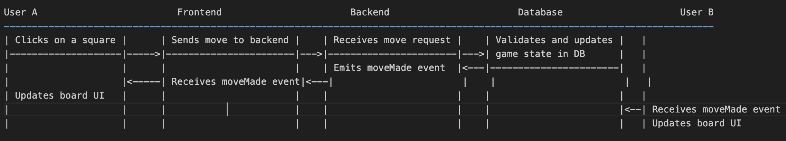

# Introduction
The Tic-Tac-Toe application is a full-stack web application that allows users to play the classic game of Tic-Tac-Toe against other players in real-time. The application supports user authentication, game state management, and live chat functionality within each game session.

## Technology Stack

**Frontend:**
- **React.js:** For building dynamic and interactive user interfaces.
- **Axios:** For making HTTP requests to the backend API.
- **Socket.IO Client:** For real-time, bi-directional communication between the client and server.
- **Tailwind CSS / CSS Modules:** For styling the application.

**Backend:**
- **Node.js with Express.js:** For building RESTful API endpoints and handling server-side logic.
- **Socket.IO:** For real-time, event-based communication.
- **MongoDB with Mongoose:** For storing and managing application data.
- **JWT (JSON Web Tokens):** For secure user authentication.
- **dotenv:** For managing environment variables.
- **CORS:** For handling Cross-Origin Resource Sharing.

## Application Architecture

The application follows a client-server architecture where:
- The frontend (client) handles the user interface and interactions, sending requests to the backend and updating the UI based on responses and real-time events.
- The backend (server) handles business logic, processes requests, interacts with the database, and manages real-time communication.

**Key Components:**
1. **Frontend:**
- **Pages:** Represent different views (e.g., Home, Login, Game).
- **Components:** Reusable UI elements (e.g., Board, Square, Chat).
- **Services:** Handle API requests and real-time communication.
- **State Management:** Manages application state using React hooks or context.

2. **Backend:**
- **API Routes:** Define endpoints for user and game operations.
- **Controllers:** Contain logic for processing requests and interacting with the database.
- **Socket.IO Server:** Manages real-time events for gameplay and chat.
- **Database Models:** Define schemas for users and games using Mongoose.
- **Middleware:** Handle tasks like error handling, authentication, and CORS.

## Backend Workflow

**Server Setup**
1. **Initialize Express App:**
- Sets up the Express server instance.
- Configures middleware for JSON parsing and CORS handling.

2. **Configure Environment Variables:**
- Uses dotenv to load environment variables from a .env file.
- Contains sensitive information like database URIs and JWT secrets.

3. **Connect to MongoDB:**
- Utilizes Mongoose to establish a connection to the MongoDB database.
- Defines schemas and models for User and Game entities.

4. **Initialize HTTP and Socket.IO Servers:**
- Creates an HTTP server using Node.js's http module.
- Attaches a Socket.IO server to the HTTP server for real-time communication.

## API Endpoints

**User Routes (/api/users):**
- **POST /register:** Registers a new user by creating a user document in MongoDB and returning a JWT token.
- **POST /login:** Authenticates a user by verifying credentials and returning a JWT token.

**Game Routes (/api/games):**
- **POST /:** Creates a new game session and saves it to the database.
- **GET /:gameId:** Retrieves the current state of a specific game.
- **POST /:gameId/move:** Updates the game state with a new move.
- **POST /:gameId/chat:** Stores and retrieves chat messages for a game session.

**Middleware:**
- **Authentication Middleware:** Verifies JWT tokens to protect certain routes.
- **Error Handling Middleware:** Catches and processes errors, sending appropriate responses to the client.

## WebSocket Communication

**Socket.IO Events:**
- **Connection:** Establishes a new WebSocket connection with a client.
- **joinGame:** Allows a client to join a specific game room based on gameId.
- **makeMove:** Handles real-time broadcasting of moves made by players to all clients in the game room.
- **sendMessage:** Manages real-time chat by broadcasting messages to all clients in the game room.
- **Disconnect:** Handles cleanup when a client disconnects.

**Workflow:**
1. When a client connects, Socket.IO establishes a persistent connection.
2. Clients can join specific game rooms to receive real-time updates related to that game.
3. Moves and chat messages are emitted to the server and broadcasted to all clients in the respective room.
4. Server ensures synchronization of game state across all connected clients.

## Database Operations

**User Model:**
- **Schema Fields:** name, email, password (hashed), totalWins, totalMatches, createdAt, updatedAt.

- **Operations:**
  - Create new users during registration.
  - Retrieve and verify user credentials during login.
  - Update user statistics (e.g., incrementing wins).

**Game Model:**
- **Schema Fields:** players (array of user IDs), board (array representing the game state), currentTurn, winner, createdAt, updatedAt.

- **Operations:**
  - Create new game sessions when a game is initiated.
  - Update the board state after each move.
  - Determine and update the winner status.
  - Fetch game state for clients joining an ongoing game.
  - Store and retrieve chat messages associated with a game.

## Frontend Workflow

**UI Components**
**Pages:**
- **Home Page:** Landing page providing options to login or start a game.
- **Login Page:** Allows users to authenticate themselves.
- **Game Page:** Main interface for playing the game and chatting.

**Components:**
- 
- 

## API Integration

**Using Axios for HTTP Requests:**
- **Setup:**
  - Axios instance configured with base URL from environment variables.

- **Authentication:**
  - **Register:** Sends user details to /api/users/register and stores received JWT token.
  - **Login:** Sends credentials to /api/users/login and stores received JWT token.

- **Game Management:**
  - **Start Game:** Sends a request to /api/games to create a new game session.
  - **Fetch Game State:** Retrieves current game state from /api/games/:gameId.
  - **Make Move:** Sends move details to /api/games/:gameId/move to update the game state.
  - **Chat Messages:** Sends and retrieves chat messages via /api/games/:gameId/chat.

**Handling Responses and Errors:**
- Updates UI based on successful responses (e.g., updating the board state).
- Displays error messages to users in case of failures (e.g., invalid credentials).

**Authentication Handling:**
- JWT tokens are stored in local storage or context.
- Protected routes/components check for valid authentication tokens before rendering.

## Real-time Communication

**Using Socket.IO Client:**
- **Connection:**
  - Establishes a Socket.IO connection to the backend server upon loading the game page.

- **Joining Rooms:**
  - Clients emit joinGame event with gameId to join specific game rooms.

- **Making Moves:**
  - Upon a player making a move, emits makeMove event with move details.
  - Listens for moveMade events to update the board in real-time when opponents make moves.

- **Chatting:**
  - Emits sendMessage event with message details.
  - Listens for receiveMessage events to display incoming chat messages instantly.

- **Disconnecting:**
  - Handles cleanup upon navigating away or closing the browser.

**State Management:**
- React hooks manage local component states (e.g., board state, chat messages).
- Updates are triggered by both user interactions and incoming Socket.IO events.

**Error Handling:**
- Listens for and handles connection errors or disconnections gracefully.
- Provides feedback to users in case of real-time communication issues.

## End-to-End User Flow
Let's walk through the typical user interactions and how the frontend and backend collaborate to fulfill these actions.

### User Registration and Login

**Registration Flow:**
1. **User Action:**
   - User navigates to the registration form and enters their details (name, email, password).

2. **Frontend Processing:**
   - Validates input fields.
   - Sends a POST request to /api/users/register with user details using Axios.

3. **Backend Processing:**
   - userController.registerUser receives the request.
   - Checks if the email is already in use.
   - Hashes the password and creates a new user document in MongoDB.
   - Generates a JWT token for authentication.
   - Sends back a response with user info and JWT token.

4. **Frontend Response Handling:**
   - Stores JWT token securely (e.g., in local storage).
   - Redirects user to the home or game page.
   - Updates UI to reflect logged-in state.

**Login Flow:**
1. **User Action:**
   - User navigates to the login form and enters their credentials.

2. **Frontend Processing:**
   - Validates input fields.
   - Sends a POST request to /api/users/login with credentials.

3. **Backend Processing:**
   - userController.loginUser receives the request.
   - Retrieves user by email and compares hashed passwords.
   - Generates a JWT token upon successful authentication.
   - Sends back a response with user info and JWT token.

4. **Frontend Response Handling:**
   - Stores JWT token securely.
   - Redirects user to the dashboard or game page.
   - Updates UI to reflect logged-in state.

## Starting a New Game

1. **User Action:**
   - User clicks on "Start New Game" button.

2. **Frontend Processing:**
   - Sends a POST request to /api/games with necessary data (e.g., opponent's ID).

3. **Backend Processing:**
   - gameController.createGame receives the request.
   - Creates a new game document in MongoDB with initial state.
   - Returns game details including gameId.

4. **Frontend Response Handling:**
   - Redirects user to the game page with the gameId.
   - Establishes Socket.IO connection and joins the game room using gameId.
   - Renders the game board and waits for the opponent to join.

5. **Opponent's Flow:**
   - Receives invitation or accesses the game via shared gameId.
   - Joins the game room through Socket.IO.
   - Frontend fetches current game state from /api/games/:gameId.

## Making a Move
1. **User Action:**
   - Player clicks on an empty square to make a move.

2. **Frontend Processing:**
   - Updates local board state optimistically.
   - Sends a POST request to /api/games/:gameId/move with move details (index, player symbol).
   - Emits makeMove event via Socket.IO with move details.

3. **Backend Processing:**
   - gameController.makeMove receives the HTTP request.
   - Validates move (e.g., correct turn, valid position).
   - Updates game document in MongoDB with new board state.
   - Checks for a winner or draw.
   - Emits moveMade event via Socket.IO to all clients in the game room with updated game state.

4. **Frontend Response Handling:**
   - Listens for moveMade event and updates board state accordingly.
   - Updates UI to indicate turn changes or game over status.
   - Handles any errors or invalid moves by reverting local board state and displaying messages.

### Real-time Synchronization:

   - All players see the updated board state instantly due to Socket.IO events.
   - Ensures consistency and fairness by validating moves on the server-side.

## Chatting Within a Game

1. **User Action:**
   - Player types a message and clicks send within the game's chat interface.

2. **Frontend Processing:**
   - Emits sendMessage event via Socket.IO with message content and sender info.
   - Optionally, displays the message immediately in the chat UI.

3. **Backend Processing:**
   - Listens for sendMessage event.
   - Broadcasts receiveMessage event to all clients in the game room with message details.
   - Optionally, stores the chat message in the database for persistence.

4. **Frontend Response Handling:**
   - Listens for receiveMessage events.
   - Updates chat UI to display new messages from all players.
   - Handles timestamps and sender identification for clarity.

**Additional Features:**
- **Chat History:** When a player joins an existing game, the frontend can fetch past messages from /api/games/:gameId/chat to display chat history.
- **Notifications:** UI can provide notifications for new messages or important game events.

## Summary

The application provides a real-time, interactive Tic-Tac-Toe gaming experience by leveraging a combination of RESTful APIs and WebSocket communication. The frontend handles user interactions and UI updates, while the backend manages data persistence, business logic, and real-time event broadcasting.

**Key Takeaways:**
- **Seamless Integration:** Combining HTTP requests for initial data fetching and WebSockets for real-time updates ensures efficient and responsive interactions.
- **Robust Architecture:** Modular design with clear separation of concerns enhances maintainability and scalability.
- **Security Measures:** Proper authentication using JWT and controlled CORS policies protect the application from unauthorized access and cross-origin issues.
- **User Experience:** Optimistic UI updates and instant feedback through real-time communication enhance user engagement and satisfaction.

## Diagrammatic Representation
To further clarify the workflow, here's a simplified sequence diagram representing the interaction during a typical game move:

**Explanation:**
1. User A makes a move which is sent to the backend via the frontend.
2. Backend validates and updates the game state in the database.
3. Backend emits a moveMade event through Socket.IO.
4. Both User A and User B receive the moveMade event and update their respective UIs accordingly.

Thank you for reading!